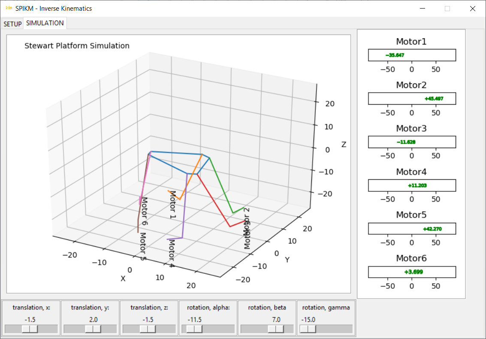
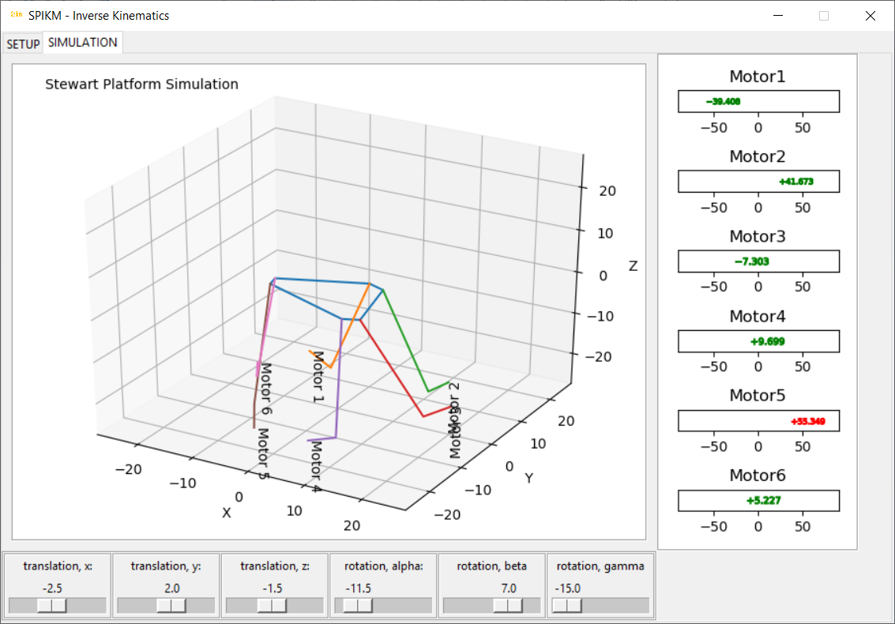

# SPIKM
Stewart Platform Inverse Kinematic Model

## Quickstart Guide

### Clone SPIKM

`git clone https://github.com/udayansarin/SPIKM`

### Run the Interface
`cd SPIKM`
`python interface.py`

### Design the Platform

### Simulate

**Use 6-dof throttle controllers to move the simulation**

**Motor angles changing to red indicate motion beyond the design range of motion**

