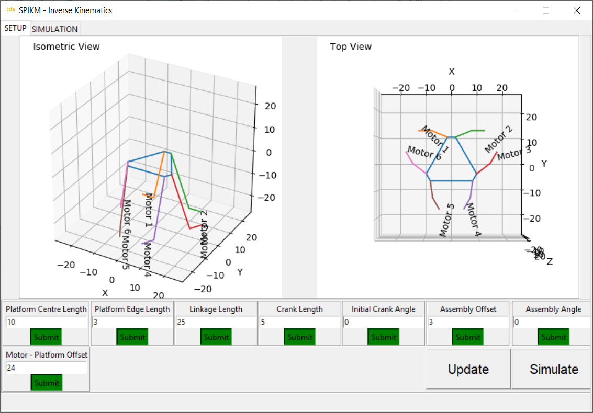

# SPIKM
Stewart Platform Inverse Kinematic Model

## Quickstart Guide

### Clone SPIKM

`git clone https://github.com/udayansarin/SPIKM`

### Run the Interface
`cd SPIKM`

`python interface.py`

### Design the Platform

### Simulate

**Use 6-dof throttle controllers to move the simulation**

**Motor angles changing to red indicate motion beyond the design range of motion**

## Definition of Design Parameters

- Platform Edge Length: Length of the platform's hexagonal edges where the linkages are connected
- Platform Centre Length: Perpendicular distance between the centre of the platform and the edge where the linkages are connected
- Linkage Length: Length of the linkage in the crank assembly
- Crank Length: Length of the crank in the crank assembly
- Initial Crank Angle: Resting angle of the motor shaft connected to the crank. 0 means the crank is horizontal
- Assembly Offset: Normal distance between the point in the xy plane where a motor shaft is located and the corresponding short edge at which its linkage is connected
- Assembly Angle: Angle in the xy plane subtended between the plane of rotation of the crank and the corresponding line representing the short edge of the platform
- Motor - Platform Offset: Normal distance between the flat planes formed by the platform surface and the plane containing all 6 motor shafts at the home position
